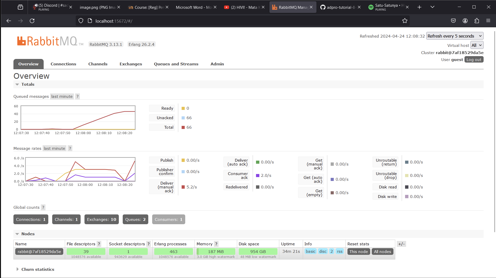

## Reflection for Subscriber

### What is AMQP?
AMQP adalah Advanced Message Queuing Protocol yang digunakan untuk melakukan pertukaran pesan antara sistem atau komponen berbeda. Dengan AMQP, maka komunikasi antara komponen yang berbeda dapat dilakukan dengan mendefinisikan protokol untuk pertukaran message seperti message queuing, routing, dan security. Selain itu, komunikasi secara asinkronus juga dapat dilakukan dengan AMQP sehingga berguna untuk sistem terdistribusi yang mana komponen bisa saja beroperasi secara independen dan memerlukan komunikasi dengan komponen lain secara asinkronus.

### What it means? guest:guest@localhost:5672 , what is the first quest, and what is the second guest, and what is localhost:5672 is for?
"guest:guest@localhost:5672" merupakan string untuk koneksi yang mencakup username, password, server address (localhost) dan juga port number. "guest:guest" menandakan kombinasi username dan password untuk autentikasi. Program ini akan dihubungkan untuk dikoneksikan ke AMQP server karena menggunakan port 5672 yang biasa digunakan untuk AMQP Protocol.

### Add the screen capture of yours, and answer why the total number of queue is as such

Pada gambar di atas, dapat dilihat bahwa terdapat lebih dari 40 queued message pada suatu saat. Hal ini karena terdapat line of code thread::sleep(ten_millis); yang diuncomment, sehingga program akan sleep selama beberapa milisekon dan memerlukan waktu yang lebih panjang untuk mengelola event di dalam message queue.